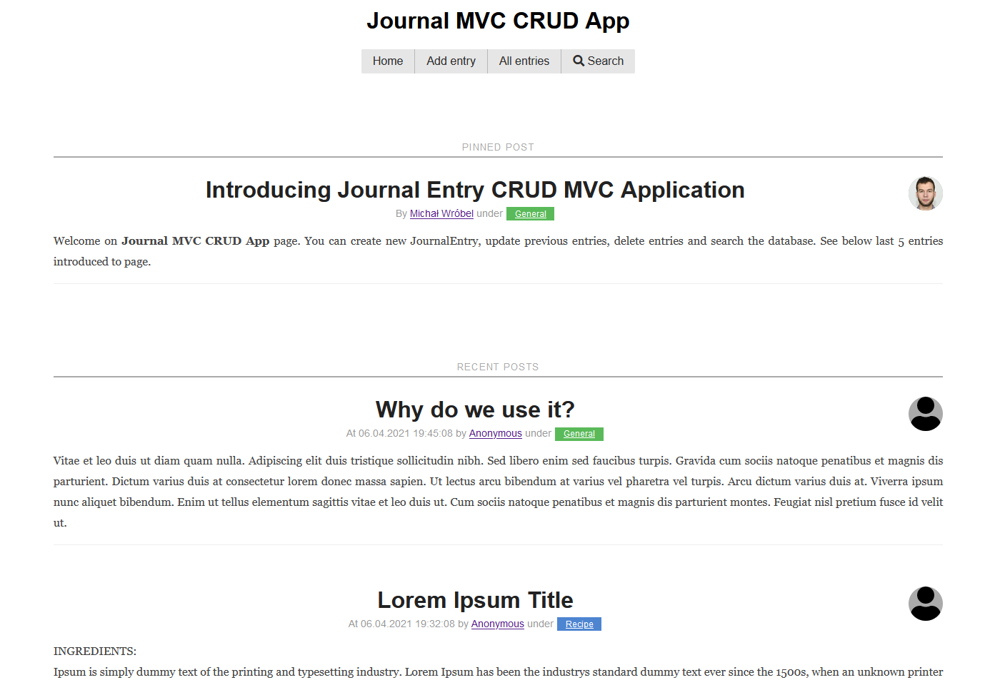
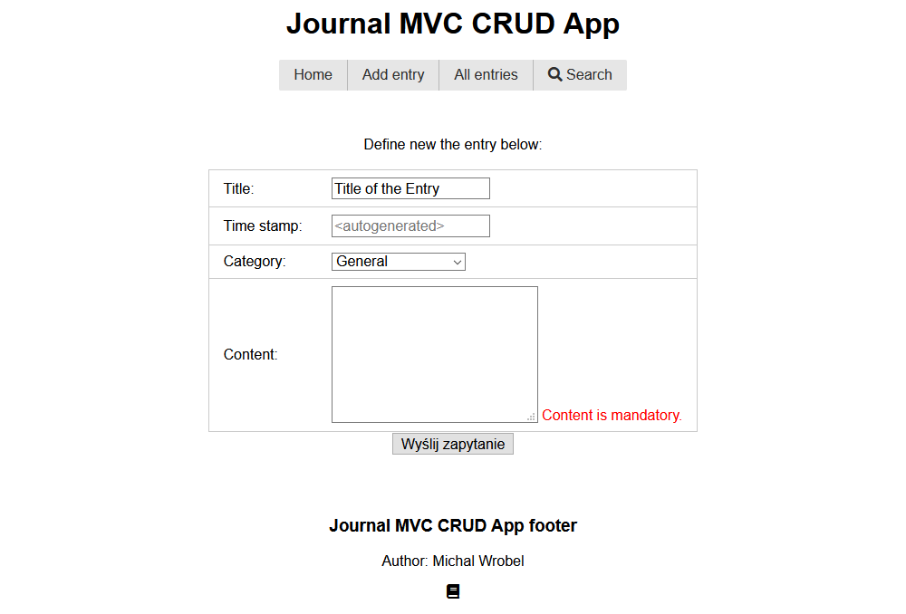
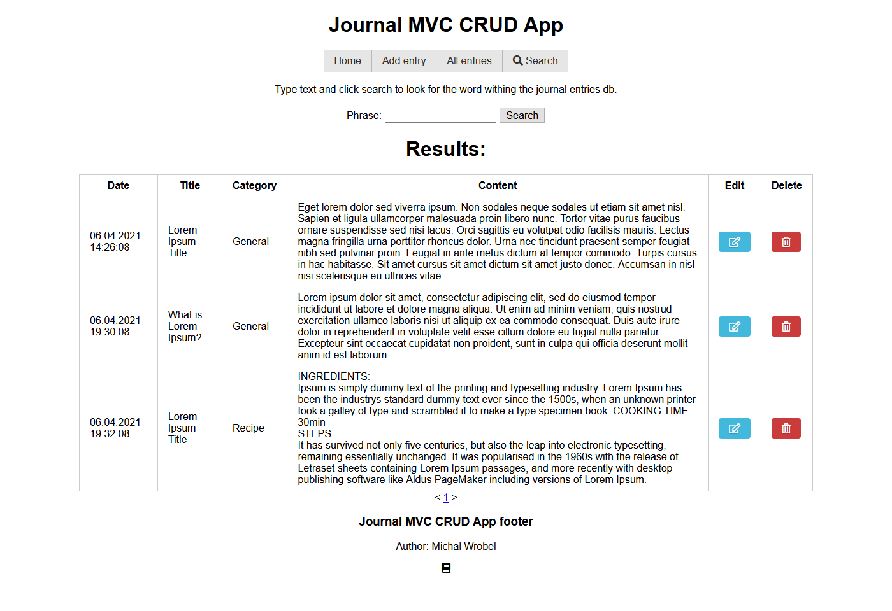
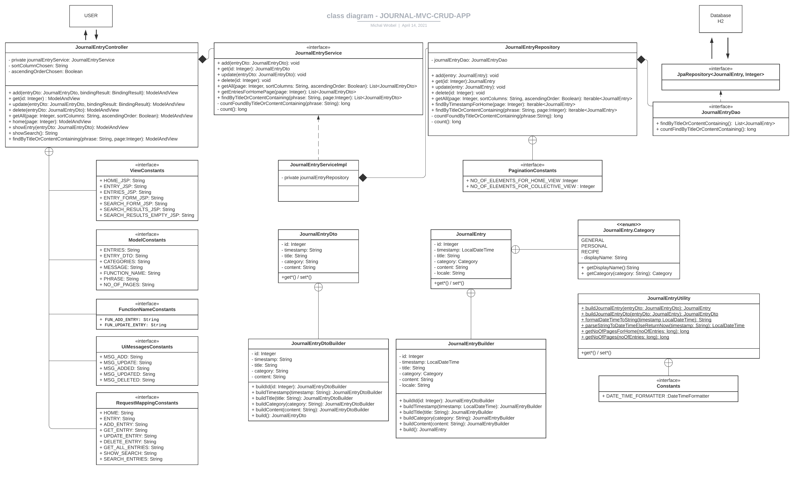

# journal-app
[![Issues][issues-shield]][issues-url]
[![LinkedIn][linkedin-shield]][linkedin-url]

<!-- PROJECT LOGO -->
 

  

  <h3 align="center">JOURNAL-MVC-CRUD-APP</h3>

  

     README journal-mvc-crud-app project 
     
    <a href="https://github.com/m-wrobel91/journal-app"><strong>Explore the docs »</strong></a>
     
         <a href="https://github.com/m-wrobel91/journal-app/issues">Report Bug</a>
    ·
    <a href="https://github.com/m-wrobel91/journal-app/issues">Request Feature</a>
  

  

<!-- TABLE OF CONTENTS -->

  
Table of Contents

  <ol>
    <li>
      <a href="#about-the-project">About the Project</a>
      <ul>
        <li><a href="#uml-class-diagram">UML class diagram</a></li>
        <li><a href="#built-with">Built with</a></li>
        <li><a href="#more-to-go">More to go</a></li>
      </ul>
    </li>
    <li><a href="#contact">Contact</a></li>
    <li><a href="#acknowledgements">Acknowledgements</a></li>
  </ol>

<!-- ABOUT THE PROJECT -->
## About The Project
  
:notebook: Application is a simple journal that allows adding new entries, update and delete existing ones. User also might look for the specific entry using search form. While adding or updating the entry the data inserted is validated. Entries in the journal might be categorized.

  <figure>
    
     
    
Fig.1 - Screenshot from the application.

    </figure>

This project was created in order to learn more on java web applications and acquire good programming habits.  Great attention was paid on clean code rules while writing the code. Domain-driven-design principles were followed while building the application. Each of the domain layer has its own role in the application - some of them might have been used a bit excessively taking into consideration app simplicity. Journal is backed by H2 database. For retrieving and saving data to database JPA Repository was used - that allowed for simple sorting and pagination of retrieved data.

  <figure>
    
     
    
Fig.2 - Form input validation.

    </figure>

  <figure>
    
     
    
Fig.3 - Search results that allow on edition and deletion.

    </figure>

### UML class diagram
Find below UML class diagram for the application:

  <figure>
    
     
    
Fig.4 - UML class diagram.

    </figure>

### Built With

Below find  major frameworks that was used to build project. 
* [Spring Boot](https://spring.io/projects/spring-boot)
* [Spring](https://spring.io/)
* [Spring Web MVC](https://docs.spring.io/spring-framework/docs/3.2.x/spring-framework-reference/html/mvc.html)
* [Spring Data JPA](https://docs.spring.io/spring-data/jpa/docs/current/reference/html/#reference)
* [H2 database](https://www.h2database.com/)
* [Hibernate Validator](https://hibernate.org/validator/)
* [Maven](https://maven.apache.org/)
* [JSP](https://www.oracle.com/java/technologies/jspt.html)

### More to go
There is number of functionalities that might be added to the application such as:
- logging, 
- authorization that might allow for number of users, hiding of `Personal` categorized entries that might be read only by the author user,
- locale to determine where the entry was created.

<!-- CONTACT -->
## Contact

Michał Wróbel 
- [Github page](https://github.com/m-wrobel91)
- [Linkedin page](https://www.linkedin.com/in/micha%C5%82-wr%C3%B3bel-85055012a/)

<!-- ACKNOWLEDGEMENTS -->
## Acknowledgements

* [Pure CSS](https://purecss.io/)
* [Font Awesome](https://fontawesome.com)

<!-- MARKDOWN LINKS & IMAGES -->

[issues-shield]: https://img.shields.io/github/issues/m-wrobel91/journal-app.svg?style=for-the-badge
[issues-url]: https://github.com/m-wrobel91/Best-README-Template/issues

[linkedin-shield]: https://img.shields.io/badge/-LinkedIn-black.svg?style=for-the-badge&logo=linkedin&colorB=555
[linkedin-url]: https://www.linkedin.com/in/micha%C5%82-wr%C3%B3bel-85055012a/
[github-url]: https://github.com/m-wrobel91
[app-logo]: images/book-solid.svg
